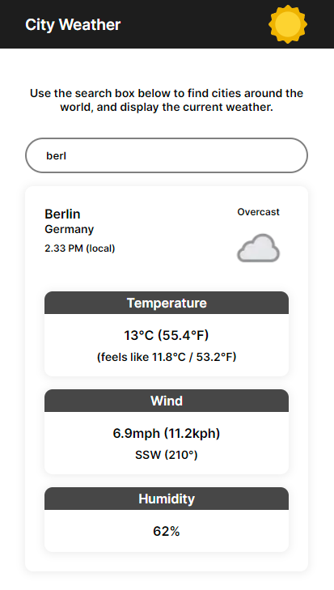

This is a [Next.js](https://nextjs.org/) project bootstrapped with [`create-next-app`](https://github.com/vercel/next.js/tree/canary/packages/create-next-app).

## Getting Started

First, run the development server:

```bash
npm run dev
# or
yarn dev
# or
pnpm dev
# or
bun dev
```

Open [http://localhost:3000](http://localhost:3000) with your browser to see the result.

## City Weather



This is a basic application which allows the user to see the current weather in cities all around th world.

- Enter a full/partial city name in the input
- Choose a result from the data shown on screen
- See detailed results for the chosen result

> Data provided by the [Weather API](https://www.weatherapi.com/) - free accounts get up to 1 million calls per month.
